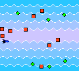

# Galaxia

## Tech Infos
* Game Boy Color
* LR35902 8bit CPU 
* Pure assembler code
* Minigame compo entry (1024 bytes size limit (including header and N logo))
* up/down/left/right to move
*  A/B to shot

## Screenshots

## Authors
* code : **Tomasz Słanina** - [dox](https://github.com/tslanina)
## License
This project is licensed under the GPL v3 License - see the [LICENSE](LICENSE) file for details
